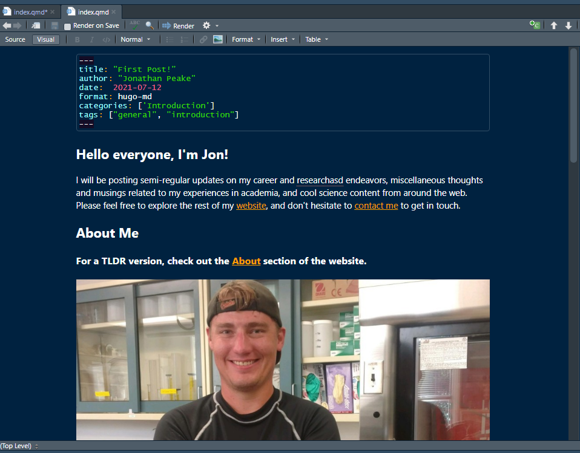

So, as it turns out, content creation is not particularly easy, especially when one is attempting to wrap up a PhD program! While I had envisioned making more than just the one single “welcome” blog post since the inception of my website a little over a year ago, my personal and professional lives had other ideas. Between moving from my old apartment into a place of my own, starting a new job with the Florida Fish and Wildlife Research Institute, working hard on my dissertation and side projects, and generally trying to stay sane during a global pandemic, I had to put my blog and website on the back-burner. Almost a year removed from starting my job at FWC, I decided it was probably a good idea to update my website to reflect a new step in my career path.

I am now hosting my website through Netlify, which is considerably easier to use and manage through blogdown and Hugo than the older iteration of my website hosted through Github Pages. Netlify is a webpage building and hosting service that can directly build a Hugo website from any Github repository (public or private). Not only does it do this efficiently and without the need to render HTML before pushing to Github, it also allows for continuous automated builds from Github commits. As soon as a commit is pushed to the repository, Netlify detects it and re-builds your website without any further action on the part of the website designer.

I have also discovered the wonderful world of Quarto open-source publishing software. You can think of Quarto as an enhanced version of RMarkdown, which allows rendering of plain-text markdown files that include R code and computations. Quarto takes the concept of RMarkdown and expands it to include Python, Julia, and Observable content, allowing for cross-language technical reports, documents, presentations, and yes, HTML and web content! It also includes several enhancements over RMarkdown that eliminate the need for different R and software packages that provide different utility by integrating it all into one software package. Quarto content is also easy to produce and visualize using RStudio’s new visual markdown editing tool, which uses a “What you see is what you mean” approach to view markdown files (i.e., editing the file is much more akin to editing a document in a word processor, rather than looking at a bunch of monospaced text and markdown code).

Quarto can render plain-text markdown files into a number of different formats, including PDF, HTML, documents, slide presentations, books, and even full webpages. Quarto websites are clean and easy to build and edit. While I personally prefer the layout and customization of a Hugo-based website for my professional webpage (this website, for example, uses the Academic theme from Wowchemy), Quarto is great for blogs as well as for data projects and website. If you’re looking to build a simple, clean, easy-to-build website, I highly suggest giving Quarto a look. There are a number of how-to blog posts out there for building a Quarto website that are very useful. As for me, while the base of my website will continue to be Hugo, consider me a Quarto convert for all future blog content.

## From “blog” to “digital garden”
